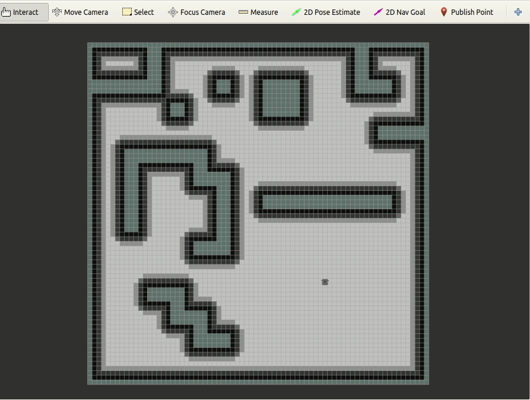
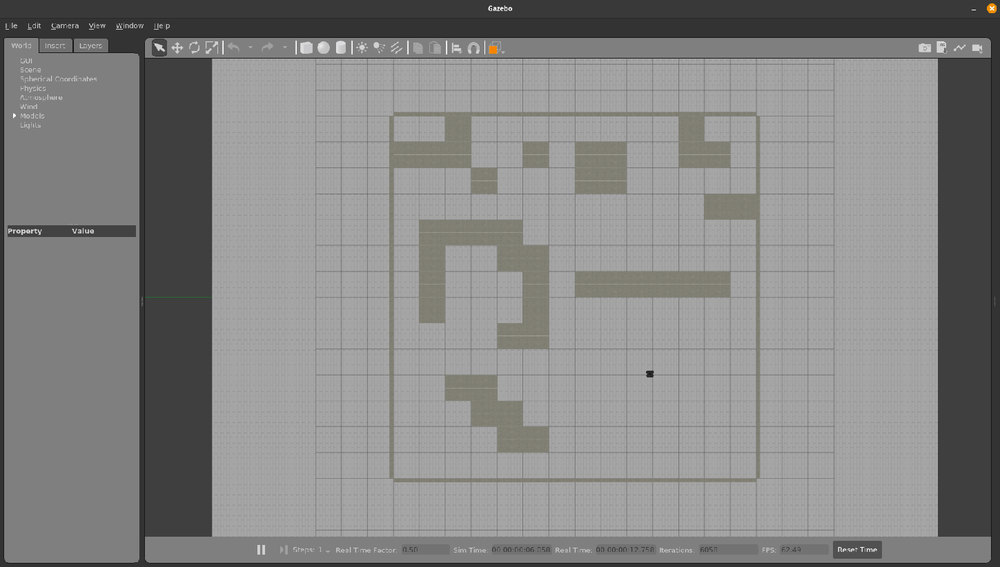
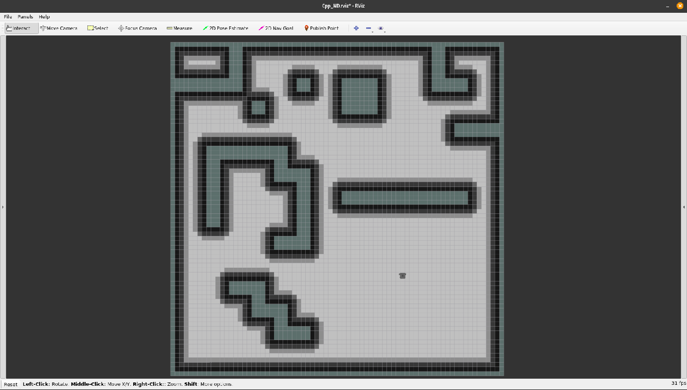

<h1>CppND-Capstone-Project: Robot Simulation</h1>



- [1. About The Project](#1-about-the-project)
- [2. Main Components](#2-main-components)
- [3. Dependencies](#3-dependencies)
- [4. How To Build](#4-how-to-build)
- [5. Run Simulation](#5-run-simulation)
- [6. Rubric Points](#6-rubric-points)
- [7. Acknowledgements](#7-acknowledgements)

## 1. About The Project

This project simulates robot path planning process using ROS and Gazebo simulation environment, featuring a visulization of the expanding process of the algorithm. It helps the algorithm learner to understand intuitively how the path planning algorithm really works. Currently only A* algorithm implemented, more such as Dijkstra, can be added so that performance between them can be compared.

## 2. Main Components

**robot_simulation**: the package that my contribution focus on in this project  
  - path_planner_server: a ROS service server that response with a path after getting the request of a global path from the client
  - path_planner: called by the server and plan the path
  - expand_visual: visualize the expanding process

**pp_msgs**: a customized ROS srv file.  
**srv_client_plugin**: A ROS global planner that creates service request for a plan and forwards the response to the move_base global planner module.  
**turtlebot3_description**: a robot model.  

## 3. Dependencies

- ROS ([Noetic][ros-noetic-installation] for Ubuntu 20.04 or [Kinetic][ros-kinetic-installation] for Ubuntu 16.04)
  
  ROS **Desktop-Full** version is recommended since we need gazebo as simulator and Rviz as visulizer

- [catkin_tools][catkin-tools-doc]
  
  Installation: make sure ROS is installed on your system (or ROS repo is added into the software source)
  ```bash
  sudo apt install python-catkin-tools
  ```

## 4. How To Build

- Step 1: Initialize a catkin working space

  ```bash
  mkdir CppND_ws    #take any name you like
  cd CppND_ws
  mkdir src
  catkin init
  ```

- Step 2: Clone the package

  ```bash
  cd src
  # for ROS kinetic
  git clone -b kinetic https://github.com/vacuum136/CppND-Capstone.git

  # for ROS noetic
  git clone https://github.com/vacuum136/CppND-Capstone.git
  ```

- Step 3: Fixup Udacity Vitual Deskptop Environment Build Error
  
  > CMake Error at /opt/ros/kinetic/share/costmap_2d/cmake/costmap_2dConfig.cmake:113 (message):  
  Project 'costmap_2d' specifies '/usr/include/hdf5/openmpi' as an include dir, which is not found.  It does neither exist as an absolute directory nor in '${{prefix}}//usr/include/hdf5/openmpi'.  Check the website 'http://wiki.ros.org/costmap_2d' for information and consider reporting the problem. 

  ```bash
  # Reason: dependencies confict. Install the following package with specified version.
  sudo apt install libvtk6.2=6.2.0+dfsg1-10build1+debian11.1+osrf1 libpcl-dev libvtk6-dev=6.2.0+dfsg1-10build1+debian11.1+osrf1 libvtk6-java=6.2.0+dfsg1-10build1+debian11.1+osrf1 tcl-vtk6=6.2.0+dfsg1-10build1+debian11.1+osrf1 python-vtk6=6.2.0+dfsg1-10build1+debian11.1+osrf1 libvtk6.2-qt=6.2.0+dfsg1-10build1+debian11.1+osrf1  libvtk6-qt-dev=6.2.0+dfsg1-10build1+debian11.1+osrf1 vtk6=6.2.0+dfsg1-10build1+debian11.1+osrf1
  ```

- Step 4: build the package

  ```bash
  catkin build
  ```

## 5. Run Simulation

> **Warning: Runtime Error in Vitural Desktop Environment**  
> Traceback (most recent call last):  
  File "/opt/ros/kinetic/share/xacro/xacro.py", line 55, in <module> import xacro  
  File "/opt/ros/kinetic/lib/python2.7/dist-packages/xacro/__init__.py", line 35, in <module> import glob  
  File "/root/miniconda3/lib/python3.7/glob.py", line 4, in <module> import re  
  ModuleNotFoundError: No module named 're'  
  **Solution**
  >```bash
> #Step 1: edit .bashrc file and delete "/root/miniconda3/bin:". The PATH should look as below:
> export PATH=/opt/utils/bin:/usr/local/sbin:/usr/local/bin:/usr/sbin:/usr/bin:/sbin:/bin:/opt/VirtualGL/bin:/opt/TurboVNC/bin:/opt/swift/swift-4.0.3-RELEASE-ubuntu16.04/usr/bin
> # Step 2
> source ./~bashrc
> ```  


> **Notice**: make sure you've set ROS's evironment properly and add the CppND workspace into the ROS environment  
> Option 1: set everytime you launch a terminal
> ```bash
> # Assuming you're using bash shell
> source /opt/ros/[ros-version]/setup.bash
> source .../CppND_ws/devel/setup.bash
> ```
> Option 2: put the above two line into the .bashrc file and save.

Step 1: launch gazebo simulator

```bash
roslaunch robot_simulation robot_gazebo.launch
```


Step 2: launch path planner node

```bash
roslaunch robot_simulation robot_planner.launch
``` 


Then you can simulate the path planning in Rviz. Using the "2D Navi Goal" to set the goal for robot. Once the goal is set, a visualized expanding process will start. After it reachs the goal, the robot will then move along with the founded path to the goal. 

## 6. Rubric Points  

> Loops, Functions, I/O  
> - The project demonstrates an understanding of C++ functions and control structures.

- while loop: path_planner.cpp line 20-60
- for loop: path_planner.cpp line 39-59
- do-while loop: path_planner.cpp line 66-70

> Object Oriented Programming  
> - The project uses Object Oriented Programming techniques. 
> - Classes use appropriate access specifiers for class members.
> - Class constructors utilize member initialization lists. 
> - Classes abstract implementation details from their interfaces.
> - Classes encapsulate behavior

- see class PathPlanner and ExpandVisual
- see publich and private members in class PathPlaner and ExpendVisual
- initialization lists see PathPlanner Constructor and ExpandVisual Constructor
- PathPlanner::getPath(), see path_planner.h line 66

> Memory Management  
> - The project makes use of references in function declarations. 
> - The project uses move semantics to move data, instead of copying it, where possible.
> - The project uses smart pointers instead of raw pointers.

- one of the PathPlanner's contructor's parameter is a reference to the costmap
- using move semantics when pushing back founed neighbor cell into open list. See path_planner.cpp line 56
- sensor_msg/CloudPoint2 is a share_point of point cloud vector. See expand_visual.cpp line 32.

## 7. Acknowledgements

- This Project inspired by the path planning tutorial by [rfzeg](https://github.com/rfzeg/path_planning_intro), which basically built with Python.
- Thanks [turtlebot3](https://github.com/ROBOTIS-GIT/turtlebot3) for the robot model.


[catkin-tools-doc]: https://catkin-tools.readthedocs.io/en/latest/installing.html
[ros-noetic-installation]: http://wiki.ros.org/noetic/Installation/Ubuntu
[ros-kinetic-installation]: http://wiki.ros.org/kinetic/Installation/Ubuntu